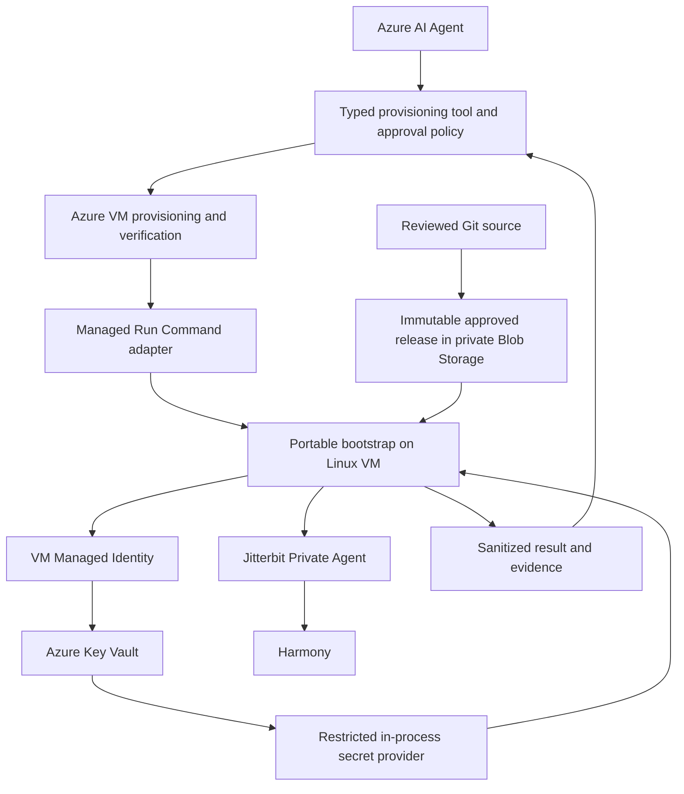

# Proposed architecture

> Phase 1.5 addendum (2026-09-22): historical Phase 0/1 content below is preserved. Current readiness and reconciled decisions are in the Phase 1.5 summary (source repository), dependency register (source repository) and Phase 2 specification (source repository). Runtime code/schemas remain Phase 1.

**REASONABLE ENGINEERING DESIGN**, pending Phase 0 review. Initial target confirmed by the user: **Ubuntu 22.04, Private Agent 12.10**. Package availability, exact build and operational compatibility remain untested.

## Components and trust boundaries



The AI caller handles resource IDs, approved artifact digests, configuration references and results. It never receives secret payloads. The infrastructure tool governs Azure mutations; the guest adapter executes a fixed entry point. Root package operations are a trust boundary: only reviewed, pinned artifacts may cross it. Azure identity tokens and Harmony credentials are different credentials and never interchangeable. Harmony is an external trust boundary, so local installation and cloud registration are separate checks.

## Proposed repository layout

```text
README.md
install.sh / validate.sh / agentctl.sh / upgrade.sh / uninstall.sh
config/
  agent.example.yaml
  private-agent-versions.yaml
  os-support.yaml
schemas/
  agent.schema.json / catalogue.schema.json / result.schema.json
lib/
  config.py / results.py / state.py / config_edit.py
scripts/
  common.sh / logging.sh / detect-os.sh / preflight.sh
  download-agent.sh / install-agent.sh / register-agent.sh
  configure-agent.sh / health-check.sh
  configure-proxy.sh / configure-ssh.sh / configure-ssl.sh / configure-jks.sh
adapters/
  packages/deb.sh / packages/rpm.sh
  registration/ / health/
providers/
  azure-key-vault/ / local-assisted/
azure/
  bootstrap.sh / deployment-contract.schema.json
tests/
  unit/ / integration/ / fixtures/ / acceptance/
docs/
  research-findings.md / architecture.md / configuration.md
  azure-integration.md / discovery-questions.md / references.md
  operations.md / troubleshooting.md
examples/
  dev.env.example / azure-cli-example.sh
```

Only documentation exists now. Thin Bash entry points orchestrate small modules; a packaged Python 3 helper is proposed for safe YAML, JSON Schema, structured results and preserving INI edits. Lock and distribute its dependencies with the bootstrap artifact. Do not rely on global pip installation, eval, shell-sourced YAML, or shell-sourced `.env`. A simpler all-JSON variant can avoid YAML dependencies if preferred before Phase 1.

The catalogue selects a reviewed adapter capability profile, never arbitrary shell command text. Known profiles can accept future approved versions without installer edits; a release introducing new behavior requires adapter work. New versions cannot safely be promised configuration-only onboarding regardless of compatibility.

## Installation state machine

```text
INITIALIZED
 -> CONFIG_LOADED -> CONFIG_VALIDATED -> VERSION_RESOLVED
 -> OS_VALIDATED -> PREFLIGHT_VALIDATED -> CURRENT_STATE_INSPECTED
 -> PLAN_READY
      dry-run -> PLANNED (exit 0, no installation-success claim)
      apply   -> LOCK_ACQUIRED -> PRECHANGE_BACKUP_COMPLETED
 -> PREREQUISITES_READY -> INSTALLER_DOWNLOADED -> INTEGRITY_VALIDATED
 -> AGENT_INSTALLED -> RUNTIME_DISCOVERED
 -> SECRETS_RESOLVED -> CONNECTION_PREREQUISITES_CONFIGURED
 -> AGENT_CONFIGURED -> REGISTRATION_PREPARED -> AGENT_STARTED
 -> HARMONY_REGISTRATION_PENDING -> HARMONY_REGISTERED
 -> POST_CONFIG_APPLIED -> HEALTH_VALIDATED -> COMPLETE
```

Every failure goes to FAILED with failingStage, lastCompletedStage, errorCode, sanitized message, retryable flag and runId. Persist safe stage evidence atomically. State files assist recovery but are not proof: re-observe package, config, identity, service and cloud state on rerun. Recheck state after acquiring the per-host lock. Phase 1 never traverses mutation states.

Configuration must precede preflight because target release, proxy and endpoints determine the checks. Proxy/custom CA needed for registration belongs before first connection, not only after registration. Phase 2 therefore requires a direct-connect test VM; mandatory corporate proxy/trust prerequisites would require a deliberate phase-scope revision, not an undocumented workaround. Optional workload certificates/keys can follow registration, with a final service/cloud recheck if restarted.

## Preflight and convergence

Read `/etc/os-release` as data and collect `uname -a`/`uname -m`. Validate explicit distro/version/architecture compatibility, capacity and free space, hostname, clock, DNS, endpoint TLS, package-manager locks/repository availability, tools, reserved-port conflicts, installed version and readable certificate references. A downloadable HTML error page is not a package: validate status, redirects, size, package identity, architecture, exact version/build and approved digest/signature before execution. URL reachability alone does not authenticate content.

Perform cheap local checks before resolving secrets. Dry-run avoids secret retrieval, downloading installers, package operations, identity changes and target writes; list network/secret checks as NOT_RUN. Optional read-only connectivity probes must be explicit. Never label unrun checks PASS.

Acquire one host lock. Compare desired state before any mutation. Same version and configuration: skip reinstall, registration and restart; run health checks. Different installed version: fail with lifecycle action required; install must not become implicit upgrade. Missing/corrupt/foreign identity: fail for inspection. No destructive retry loops or automatic unregister. Stable per-VM desired identity plus reconciliation protects concurrent fleet provisioning.

Before edits, back up only affected files with metadata and a manifest; backups containing existing secrets need encryption/access controls and retention, not a plaintext copy into a general log directory. Patch managed entries, preserve unrelated values/comments, reject duplicate ambiguous keys, validate staged output and atomically replace it. Compare content before restart. Never recursively chmod/chown the product tree.

## Security and failure flow

Disable xtrace; use allowlisted log fields, not raw vendor stdout/stderr. Capture vendor evidence only in restricted storage after leakage assessment. Exclude credentials, config dumps, process environments, signed URLs, command lines and unrestricted log tails from diagnostics. Redaction is defense in depth, not the primary secret transport.

Use restrictive umask and safe atomic file creation; prohibit writable parent directories and symlink destinations. Runtime secret files, if an approved adapter requires them, need explicit lifetime/cleanup and crash-recovery rules. SSH/SSL private keys necessarily require a protected runtime representation; establish that storage policy before implementation. Disk encryption alone does not make a plaintext configuration value compliant with the user's stated policy.

Never report SUCCESS if Harmony status is unknown. A bootstrap failure leaves a failed provisioning result and retained restricted evidence; it does not delete the VM. A successful Azure deployment does not imply a healthy agent. Recover from the last observed state; avoid promising rollback after database/schema changes.

## Phase gates and verification plan

| Phase | Deliverable and acceptance |
| --- | --- |
| 1 | Config/schema, catalogue, OS checks, logging, dry-run, state/result models. Unit fixtures for parsing, URL/version selection, unknown/unsupported rejection, duplicate YAML keys, redaction, path safety, SSL completeness, SSH modes, stale logs, timeout/exit codes. Zero mutations in dry-run. |
| 2 | Ubuntu 22.04/12.10 base lifecycle after package/registration evidence. Real VM install, reboot, repeat run and Harmony verification. Repeat run must preserve identity and avoid healthy-service restart. |
| 3 | Managed Identity, Key Vault and Azure dispatch. End-to-end result retrieval, expired/denied identity, RBAC propagation, network and secret-leakage tests. Phase 2 uses an approved local secret provider, never a plaintext shortcut. |
| 4 | Independent proxy, SSH, SSL and truststore validation including negative tests and unchanged reruns. |
| 5 | Verified upgrade edges, encrypted backups/restore drills and lifecycle diagnostics; no generic downgrade rollback. |
| 6 | Security review, interruption/failure injection, fleet concurrency, idempotency and production readiness. |

Unit and mocked integration tests cannot establish vendor compatibility. Keep sanitized, version-labelled real-VM fixtures and acceptance evidence separate.

## Release candidate architecture

`bin/jbpa` uses the RC JSON facade in `src/jbpa/release_cli.py`. It delegates lifecycle actions to the existing bootstrap, native adapter, uninstall and enterprise implementations. The new artifact layer resolves and inspects Debian files, while `contracts/` captures version-specific observed semantics. The regression runner composes these existing operations only on explicitly authorized clean disposable targets. Runtime contract compatibility and artifact approval are independent.

Latest is a mutable source, resolved once to a concrete package/hash/file for an install run. A pinned backend hands those bytes to the existing workflow; the workflow still validates dpkg fields and SHA before execution. Source catalogue approval is never mutated for experimental runs: an ephemeral controlled-test projection is used, and the result labels the qualification classification. Existing global initial-registration and lifecycle gates remain unchanged.

Release layout uses bin, lib, config, schemas, contracts, README, requirements, manifest and file sums. Source and installed layouts share the same ROOT convention. Release verification reads bounded tar entries without installing the PA. The Azure wrapper handles only framework acquisition, integrity, runtime setup and invocation; JBPA retains product lifecycle interpretation.
